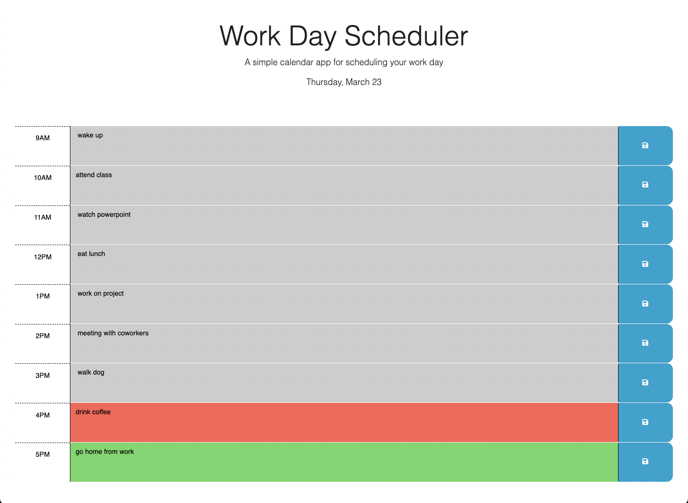

# Workday Schedule Calendar App

## Description
Our task was to create a simple calendar application that allows a user to save events for each hour of the day. The user loads into a calendar app that displays the current day and time at the top. The user can then enter tasks into hourly timeblocks on the calendar. This task will be saved as text into local storage. The timeblocks will display red for a present task, gray for a past task, and green for a future task. Upon refresh we should see all of our tasks in the calendar and the proper coloring, and text will be saved into local storage. This app runs in the browser and feature dynamically updated HTML and CSS powered by jQuery. This project was done to showcase our use and skills of javascript, local storage, and server side API.


### User Story

```md
AS AN employee with a busy schedule
I WANT to add important events to a daily planner
SO THAT I can manage my time effectively
```

###  Acceptance Criteria

```md
GIVEN I am using a daily planner to create a schedule
WHEN I open the planner
THEN the current day is displayed at the top of the calendar
WHEN I scroll down
THEN I am presented with timeblocks for standard business hours
WHEN I view the timeblocks for that day
THEN each timeblock is color coded to indicate whether it is in the past, present, or future
WHEN I click into a timeblock
THEN I can enter an event
WHEN I click the save button for that timeblock
THEN the text for that event is saved in local storage
WHEN I refresh the page
THEN the saved events persist
```
## How we accomplished this

### in HTML: 
        Added more of the time blocks "time-block" up until hour 17 in our container. They all have time classes. 
        The "past" class adds a gray background color. 
        The "present" class adds a red background color. 
        The "future" class adds a green background color. 
        We remove these classes from the block to add later in our script

### in JavaScript:
        wrap all functions in a call to the DOM
        Setting reference variables for our save button, text area for the calendar slot,
        for our time block, and setting variable for the current date, and the current hour.
        Added code to display the current date in the header of the page.        
        Added an event listener for the save button that will utilize 'this' reference
        in a jQuery call and access its text to save into local storage.
        using this keyword we can access element in container and access it's sibling
        'textarea' and parent 'id' in a JQuery call to get the text that the user inputs and the hour id.
        Storing variables in local storage (JSON)
        Added code to apply the past, present, or future class to each time
        block by comparing the id to the current hour. access current hour from dayjs and store it.
        add a for each loop to run through our container, through each time blocks.
        grabbing time block hour id and storing into a comparison variable for our ifs.
        conditionals to check current hour to apply class to timeblocks
        relative to the hour of the timeblock, checks current hour to
        see if it is in the past, present, or future, then will add that 
        class to time block.
        We function call our applyclass and this applies colors and
        classes to our timeblocks.
        Added code to get any user input that was saved in localStorage and set
        the values of the corresponding textarea elements. Individually get item from
        local storage from each time block by using Id.

## Completed Application Screenshots 
;


## Link to Github Repo:
https://github.com/shababrc/Work-Day-Scheduler  

## Link to Deployed Site:


## Credits
Starter code provided by UCLA Bootcamps, special thanks to tutor Sheetal Srikumar
and rest of class of ucla bootcamp for collaboration and suggestions, as well as teaching staff.

## License
MIT